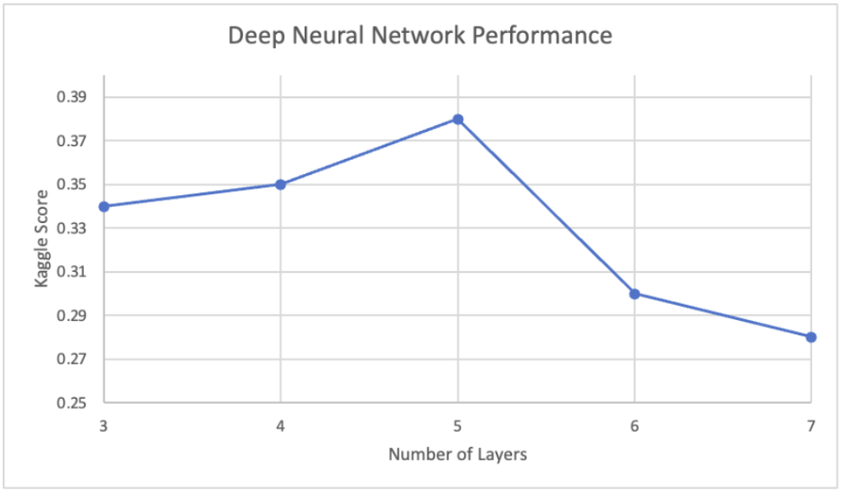

# vector-diagnosis

<!-- Output copied to clipboard! -->

<!-----

You have some errors, warnings, or alerts. If you are using reckless mode, turn it off to see inline alerts.
* ERRORs: 0
* WARNINGs: 0
* ALERTS: 3

Conversion time: 1.039 seconds.

Using this Markdown file:

1. Paste this output into your source file.
2. See the notes and action items below regarding this conversion run.
3. Check the rendered output (headings, lists, code blocks, tables) for proper
   formatting and use a linkchecker before you publish this page.

Conversion notes:

* Docs to Markdown version 1.0β34
* Sun Aug 06 2023 16:18:04 GMT-0700 (PDT)
* Source doc: homework6_report
* Tables are currently converted to HTML tables.
* This document has images: check for >>>>>  gd2md-html alert:  inline image link in generated source and store images to your server. NOTE: Images in exported zip file from Google Docs may not appear in  the same order as they do in your doc. Please check the images!

----->

**Classification with a Tabular Vector Borne Disease Dataset**

Neil Kale (nakale@wpi.edu), Arjun Venat (avenat@wpi.edu), David Gobran (dygobran@wpi.edu)

**Introduction**

The goal is to train a model which accurately diagnoses a patient with one of 11 viral diseases. The feature set is binary on 64 symptoms. There are 707 labeled examples in the training set and 302 unlabeled examples in the testing set. This problem is interesting because if we create a highly-accurate model, people without ready access to doctors could diagnose themselves.

**Methods**

_PCA_

As a preliminary exploration of the data, we attempted to use PCA to determine how separable the problem space is. The top two PCA features are plotted below.

Figure 1. In 2D, the disease classes are not very separable.

We also tried plotting the top 3 PCA features in 3D.

 

Figure 2. In three dimensions, the disease classes are somewhat more separable.

Some pairs of diseases appear fully separate in 3D like Zika and Lyme Disease.

_Baseline_

We established a baseline with a model that always guessed the most common class, "West_Nile_Virus." This model achieved a training accuracy of 0.12 and a Kaggle test accuracy of 0.09. Since this is a multiclass regression problem similar to Homework 3, our first approach was softmax regression.

**Shallow Models**

_Softmax Regression_

We used 5-fold CV for testing hyperparameters. The dataset is only 707 datapoints, so we chose k-fold CV over hold-out validation, since we didn't want to cut down on available training data. To optimize the hyperparameters for softmax, we used sklearn’s inbuilt cross-validation grid search. This resulted in a CV score of 0.31 and Kaggle score of 0.33.

Softmax did not converge for several hyperparameter configurations, especially when the regularization constant C was high. We decided to explore random forests next in case the data contained irrelevant features.

_Random Forest_

We once again used 5-fold Cross-Validation for testing hyperparameters via grid search. We explored varying the criterion for splitting, maximum tree depth, the maximum number of features used, and the number of estimators. We found that trees with less features performed almost as well as trees with more features. This performed similarly to softmax with a CV score of 0.31 and a Kaggle score of 0.32.

Next, we decided to try Linear Discriminant Analysis, as it incorporates dimensionality reduction and accounts for high correlation between features. This makes sense in the context of our problem, as features are not entirely independent of each other. 

_Linear Discriminant Analysis_

We used Linear Discriminant Analysis (LDA) from sklearn library to determine the optimal linear combination of features for class separation. The CV accuracy was 0.32 and Kaggle testing accuracy was 0.30. However, it didn't perform significantly better than the random forest method, which performed well despite not accounting for dimensionality reduction. We then tried a more powerful variation of random forests - XGBoost, which iteratively tunes its hyperparameters during training and works better on imbalanced classes. The class imbalance was present in our training data, with the largest difference in number of examples between West_Nile_Fever (85) and Malaria (48).

_XGBoost_

We found that XGBoost did not perform as well as our other models, with a CV accuracy of 0.29 and a Kaggle testing accuracy of 0.25, possibly due to insignificant class imbalance. The highest majority class, West_Nile_fever, occurred less than twice as often as the class with the lowest frequency, Malaria.

We used the XGBClassifier interface from Scipy for our implementation, as we didn't have time to learn the full XGBoost library. We tried medical knowledge motivated feature engineering to improve model performance, by aggregating features on our random forest model.

_Random Forest with New Features_

We added aggregate features for all bleeding, all itching, and all pain/ache symptoms respectively. As the model did not perform much better, we tried adding all polynomial features to explore any possible feature interactions. However, again the model did not perform much better. Having exhausted several shallow model approaches, we attempted a neural network approach.

**Neural Networks**

_3-Layer_

We chose to implement our 3-layer Neural Network with Pytorch, as it allowed for easy modification to increase the hidden layer count. We used 5-fold cross validation to estimate the accuracy of our networks and tune our hyperparameters, as our dataset only consisted of 707 training values. The hyperparameters we chose to experiment with were: hidden size, learning rate, number of epochs, and batch size. We began by manually tweaking the hyperparameter values and observing the mean CV score across 5 folds. After much experimentation, we were able to achieve a mean CV score of 0.32 and Kaggle Score of 0.34. Our final hyperparameters were a learning rate of 0.001, 30 training epochs, a hidden layer size of 30, and a batch size of 50.

_Deep_

After finding an optimal set of hyperparameters for our 3-layer network, we began systematically adding 1 hidden (ReLU) layer at a time while keeping other hyperparameters constant. The chart below shows how the performance of the neural networks varied with the addition of layers.

It is important to note that the Kaggle score of 0.38 generated by our 5-layer neural network was our highest score from any model we created. While we’re not exactly sure why the 5-layer network yielded the highest accuracy, we reasoned that it struck the best balance between adapting to the complexity of the data due to the large number of features while not overfitting. Thus, we determined to keep experimenting with 5-layer networks to see if we could further optimize the hyperparameters.

To do this, we implemented grid search to try to find a more optimal set of hyperparameters. Unfortunately, we were unable to find a set of hyperparameters that consistently yielded better accuracy than the ones we found from manual experimentation.

**Table of Results**

<table>
  <tr>
   <td><strong>Model</strong>
   </td>
   <td><strong>Kaggle Score</strong>
   </td>
  </tr>
  <tr>
   <td>Baseline
   </td>
   <td>0.09933
   </td>
  </tr>
  <tr>
   <td>Softmax (Logistic) Regression
   </td>
   <td>0.3256
   </td>
  </tr>
  <tr>
   <td>Linear Discriminant Analysis
   </td>
   <td>0.30463
   </td>
  </tr>
  <tr>
   <td>Random Forest
   </td>
   <td>0.31567
   </td>
  </tr>
  <tr>
   <td>3-Layer Neural Network
   </td>
   <td>0.34326
   </td>
  </tr>
  <tr>
   <td><strong>Deep Neural Network (5-Layer)</strong>
   </td>
   <td><strong>0.38631</strong>
   </td>
  </tr>
  <tr>
   <td>XGBoost
   </td>
   <td>0.24834
   </td>
  </tr>
</table>

**Conclusion**

We found that our most effective model was the 5-layer neural network, which was significantly better than our best performing shallow model, softmax regression. It yielded Kaggle scores that were within 17% and 13% of the top public and private scores on the leaderboard. Our aggregate feature engineering based on medical knowledge of the disease symptoms did not yield considerable improvements. Additionally, our grid search did not help us tune our hyperparameters for our deep network as hoped for. In the future, we might try scraping outside sources for more data, since the lack of training data likely hampered our model. 

**References**

    Bronshtein, A. (2020, March 24). _Train/test split and cross validation in Python_. Medium. Retrieved April 30, 2023, from [https://towardsdatascience.com/train-test-split-and-cross-validation-in-python-80b61beca4b6](https://towardsdatascience.com/train-test-split-and-cross-validation-in-python-80b61beca4b6) 
 
Chow, A., & Lifferth, W. (n.d.). _Classification with a Tabular Vector Borne Disease Dataset_. Kaggle. Retrieved April 30, 2023, from [https://www.kaggle.com/competitions/playground-series-s3e13](https://www.kaggle.com/competitions/playground-series-s3e13)

    Gupta, A. (2021, June 1). _XGBoost versus Random Forest_. Medium. Retrieved April 30, 2023, from [https://medium.com/geekculture/xgboost-versus-random-forest-898e42870f30](https://medium.com/geekculture/xgboost-versus-random-forest-898e42870f30)

    Malato, G. (2022, May 27). _Hyperparameter tuning. grid search and Random Search_. Your Data Teacher. Retrieved April 30, 2023, from [https://www.yourdatateacher.com/2021/05/19/hyperparameter-tuning-grid-search-and-random-search/](https://www.yourdatateacher.com/2021/05/19/hyperparameter-tuning-grid-search-and-random-search/)

    Meigarom. (2022, September 13). _Is LDA a Dimensionality Reduction Technique or a Classifier Algorithm?_ Towards Data Science. Retrieved April 30, 2023, from  [https://towardsdatascience.com/is-lda-a-dimensionality-reduction-technique-or-a-classifier-algorithm-eeed4de9953a](https://towardsdatascience.com/is-lda-a-dimensionality-reduction-technique-or-a-classifier-algorithm-eeed4de9953a).
